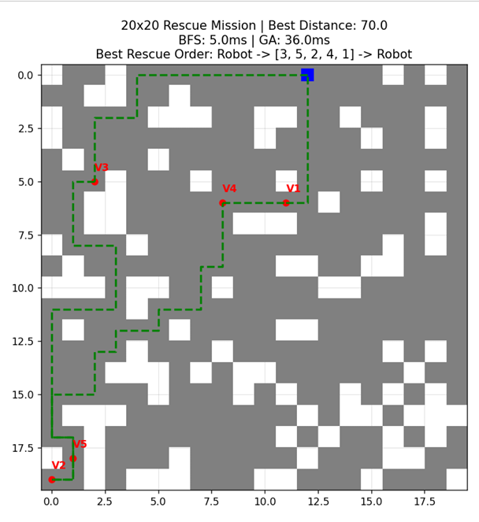

# 🤖 Rescue Mission Optimization System
### Hybrid Artificial Intelligence Approach: Genetic Algorithm & BFS Integration

---

[](https://www.python.org)
[](https://aun.edu.eg)
[]()

---

## 📌 Project Overview

This project delivers an optimized decision-making system designed for the **'Rescue Mission Order'** problem—a highly constrained variation of the Traveling Salesperson Problem (TSP) executed within a complex grid landscape. 

The core architecture decouples spatial awareness from combinatorial sequence optimization by using a robust **two-layered engine**:
1. **Low-Level Spatial Reasoning:** Powered by **Breadth-First Search (BFS)** to map physical obstacles.
2. **High-Level Metaheuristic Routing:** Powered by a **Genetic Algorithm (GA)** to solve the optimal scheduling sequence.

---

## 🛠️ System Architecture & Design Methodology

### 1.1 Spatial Reasoning via Breadth-First Search (BFS)
Before planning any high-level routing sequences, the agent must comprehend the underlying topographic constraints. Standard Euclidean distances fail in grid environments filled with static walls. 
* **Mechanism:** The system deploys a BFS traversal starting from the agent and each victim configuration.
* **Output:** It dynamically calculates exact path boundaries, dodging walls to assemble an obstacle-aware $6\times6$ **Distance Matrix**.

### 1.2 Evolutionary Sequence Planning (GA)
With structural costs calculated, the high-level routing task becomes a search optimization problem over all permutation sequences.
* **Chromosome Representation:** Utilizing **Permutation Encoding**, each unique state represents a specific sequential ordering of victim check-points.
* **Crossover Mechanism:** Implements **Ordered Crossover (OX1)**. This specialized genetic operator guarantees that children inherit valid sub-sequences from parents without introducing duplicate victim identifiers or dropping necessary stops.

---

## 📐 Mathematical Optimization & Constraints

The system relies on a continuous maximization **Fitness Function** to filter and drive generation cycles. Since the system objective is minimizing total path duration, fitness is evaluated as:

$$Fitness = \frac{1}{\text{Total\_Path\_Distance}}$$

> ⚠️ **Dynamic Constraint Handling:** > In scenarios where a target victim is entirely isolated by walls, the BFS engine attributes a spatial distance of infinity ($inf$). The mathematical evaluation naturally translates this into a fitness value of exactly **0**. This serves as an automated natural evolutionary penalty, eliminating impossible paths during selection phases without requiring manual pruning routines.

---

## ⚙️ Execution Configuration Parameters

The performance and convergence properties of the evolutionary model are defined by the following engine configuration:

| Control Parameter | Configured Value | Functional Role in System Optimization |
| :--- | :--- | :--- |
| **Grid Complexity** | $20\times20$ Matrix | Simulates a non-trivial navigation matrix containing narrow corridors and dead ends. |
| **Population Size** | 50 Solutions | Guarantees appropriate search-space coverage while avoiding premature convergence. |
| **Mutation Rate** | 0.1 (10%) | **Swap Mutation:** Interchanges two path genes to inject diversity and escape local optima. |
| **Selection Type** | Tournament (Pool: 3) | Sustains balanced evolutionary pressure by evaluating random candidate subgroups. |
| **Max Generations** | 100 Cycles | Restricts runtime while ensuring empirical convergence on the global path optimum. |

---

## 📊 Performance Visualizations

### Key Execution Metrics:
* **Environment Boundaries:** $20\times20$ Navigation Grid
* **Global Optimum Distance Found:** 70.0 units
* **BFS Matrix Generation Overhead:** 5.0 ms
* **GA Combinatorial Search Overhead:** 36.0 ms
* **Resolved Sequence Order:** $\text{Robot} \rightarrow [\text{Victim } 3 \rightarrow \text{Victim } 5 \rightarrow \text{Victim } 2 \rightarrow \text{Victim } 4 \rightarrow \text{Victim } 1] \rightarrow \text{Robot}$

#### 1. Path Traversal Simulation Map
Below is the dynamic path map rendering the collision-free trajectory found across the complex grid space:


*Figure 1: Optimized path visualization. The green dashed lines isolate the clean path trajectories calculated by the BFS spatial layer.*

---

## 💻 Technical Console Analytics

The textual logging output below illustrates runtime data processing and compilation metrics captured directly from the Python 3.12 environment interpreter during code execution:

```bash
PS D:\Data Scince Laps> C:\Users\yosse\AppData\Local\Programs\Python\Python312\python.exe "d:/Data Scince Laps/rr.py"
Total Path Distance: inf units

PS D:\Data Scince Laps> & C:\Users\yosse\AppData\Local\Programs\Python\Python312\python.exe "d:/Data Scince Laps/rr.py"
RESCUE MISSION OPTIMIZATION START
---------------------------------------------

[Requirement] Distance Matrix (6x6):
[[ 0.  7. 33. 15. 10. 31.]
 [ 7.  0. 26. 12.  3. 24.]
 [33. 26.  0. 22. 23.  2.]
 [15. 12. 22.  0.  9. 20.]
 [10.  3. 23.  9.  0. 21.]
 [31. 24.  2. 20. 21.  0.]]

BFS Construction Time: 5.00ms
GA Optimization Time: 36.00ms
Best Rescue Order: Robot -> [3, 5, 2, 4, 1] -> Robot
Total Path Distance: 70.0 units

PS D:\Data Scince Laps>